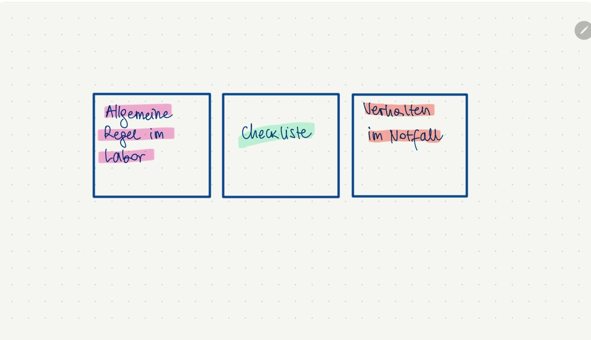
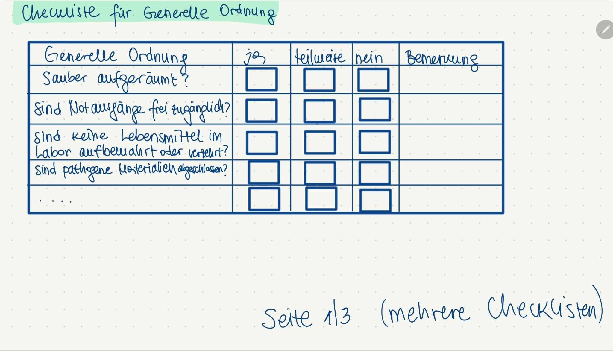

# 📱 Storyboard für die App

## 🟢 1. Startseite – Einstiegspunkt

Der Benutzer öffnet die App und sieht die Startseite. Von hier aus kann er sich anmelden oder zur Hauptfunktion der App navigieren.

---

## 🔵 2. Erste Seite – Überblick / Navigation

Nach dem Start wird der Benutzer auf die erste Hauptseite weitergeleitet. Hier befinden sich zentrale Inhalte oder die Navigation zu verschiedenen Funktionen wie Checklisten, Einstellungen etc.

---

## 🟣 3. Checkliste – Interaktive Aufgabenliste
_

In diesem Schritt sieht der Benutzer eine Checkliste mit Aufgaben oder Sicherheitsmaßnahmen. Er kann Punkte abhaken, bearbeiten oder neue hinzufügen.

---

